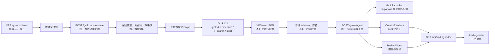

# Grok 交易博主雷达技术设计

Status: proposed  
Last updated: 2026-07-22

Decision scope: 本文经确认后，替代现有 PRD/OPERATIONS 中“官方 X Timeline、每 15 分钟 Cloudflare Cron、同步后再调用 OpenAI-compatible analyzer”的实现决定；未涉及的页面、已读、策略快照和 Telegram 规则继续沿用原 PRD。

## 1. 目标

将已经在 VPS 跑通的 Grok CLI 原型接入现有交易博主雷达，使系统每周固定执行两次 Grok 搜索，读取最多四个 X 博主关于“美股”和“BTC”的公开内容，保留原始响应，完成结构化校验和去重，写入 Supabase，并由现有 Next.js 页面读取展示。

本方案固定以下约束：

- 数据发现模型：`grok-4.5`。
- reasoning effort：`medium`。
- 每个 xAI 周额度窗口最多发起两次模型调用；失败调用也占一次。
- 最多四个启用中的博主，一次模型调用合并处理全部博主，不按博主拆成多次调用。
- 第一版关键词固定为“美股”和“BTC”。
- Supabase Postgres 是唯一线上业务数据库。
- VPS 只保存运行和待上传副本，不作为页面查询的数据源。
- 不使用官方 X Timeline API，也不把 Cloudflare、VPS 文件和 Supabase 做成三个业务数据源。
- 不自动交易；所有内容必须保留原推 URL，并明确标记为 Grok 语义发现结果。

当前已配置两个博主：

- `@KillaXBT`
- `@yijiangren`

另外两个名额暂不虚构，后续由页面或数据库配置。

## 2. 当前状态

### 2.1 已跑通

- DigitalOcean VPS 上已安装 Grok CLI `0.2.106`。
- `grok login` 和 `grok models` 已验证，账户可使用 `grok-4.5`。
- 512 MB VPS 实测单任务峰值约 91.4 MiB，并已配置 1 GB swap。
- `/opt/grok-radar` 已具备：
  - systemd oneshot 服务；
  - 原始 JSON 留存；
  - X status URL/ID 校验；
  - URL 去重；
  - 标准化 JSON 输出；
  - Grok 连续输出多个 JSON 时选择最后一个完整结果的容错。
- 两个指定博主、最近七天、“美股/BTC”真实搜索已经返回五条有效记录。
- systemd timer 当前保持关闭，不会继续消耗周额度。

### 2.2 现有应用可复用部分

现有 Prisma 模型已经包含：

- `WatchedCreator`：关注博主、启停、最近同步状态；
- `CreatorRawItem`：原始帖子、已读状态、首次导入标记；
- `TradingStrategy`：当前交易规则及版本；
- `TradingDigest`：摘要、交易信号、策略快照；
- `NotificationDelivery`：Telegram 投递幂等状态。

现有页面 `/trading-radar` 已经支持：

- 左栏关注博主和未读数量；
- 中栏帖子列表、原推链接、已读状态；
- 右栏摘要和交易信号；
- Google 登录保护。

### 2.3 必须替换的旧路径

当前 `syncWatchedCreators()` 依赖官方 X 用户时间线，新增博主也会调用官方 X API 解析账号；`getOrCreateTradingDigest()` 又会调用一次 OpenAI-compatible 模型分析帖子。

Grok 模式下必须避免下面的双重调用：

```text
官方 X Timeline → 保存帖子 → 第二个 AI 再分析
```

目标改为：

```text
一次 Grok 4.5 调用 → X 搜索 + 结构化证据/信号 → Supabase
```

同一生产环境只能启用 Grok 调度。现有 Cloudflare 15 分钟 Cron 和官方 X 同步入口必须关闭或切换成明确的 `TRADING_RADAR_SOURCE=grok-cli` 模式，不能并行写同一批 `CreatorRawItem`。

## 3. 总体架构



### 边界说明

- Grok CLI 和 OAuth 登录只存在于 VPS 的 `grok-runner` 用户下。
- VPS 不保存 Supabase `service_role` 或数据库直连密码。
- VPS 只持有一个专用摄取密钥，通过 HTTPS 调用 Vercel API。
- Prisma 和数据库写入只发生在 Next.js Node.js runtime。
- 页面只从 Next.js API 读取 Supabase，不读取 VPS 文件。

## 4. 调度与周额度

### 4.1 调度时间

默认按北京时间执行：

- 周二 08:30；
- 周五 08:30。

VPS 使用 UTC 时，对应 systemd timer：

```ini
OnCalendar=Tue,Fri *-*-* 00:30:00 UTC
Persistent=true
RandomizedDelaySec=5min
```

该节奏将一周分成约三天和四天两个窗口，并落在美股收盘以后；BTC 内容同时覆盖。

### 4.2 周额度硬限制

不能只依赖 timer 次数。每次运行必须先在 Supabase 原子预占调用名额：

1. VPS 生成唯一 `runId`。
2. 调用 `POST /api/trading-radar/grok-runs/reserve`。
3. API 根据 xAI 周重置锚点计算当前额度窗口。
4. 在 Serializable transaction 中统计该窗口已经预占/执行的 run。
5. 少于 2 次才创建 `RESERVED` 记录并返回运行配置。
6. 达到 2 次返回 `429 weekly_run_limit_reached`，VPS 不启动 Grok。

周重置锚点通过环境变量配置，例如：

```dotenv
GROK_WEEKLY_RESET_ANCHOR="2026-07-29T03:25:00Z"
GROK_RADAR_MAX_RUNS_PER_WINDOW="2"
```

当前截图中的重置时间是北京时间 7 月 29 日 11:25，即 UTC 03:25。后续每七天滚动一个窗口。

以下状态都计入两次上限：

- `RESERVED`
- `RUNNING`
- `SUCCEEDED`
- `FAILED`
- `UPLOAD_PENDING`

原因是模型启动后即可能消耗额度，不能因为本地解析或上传失败而再次调用模型。

### 4.3 失败策略

- 模型失败：保存 raw/stderr，标记 `FAILED`，不自动重跑模型。
- Supabase 上传失败：标记本地 `pending-upload`，只重试上传同一个 raw/runId，不再调用模型。
- timer 重复触发：本地 `flock` 和数据库 reservation 双重阻止并发。
- OAuth 过期：`grok models` preflight 失败，记录错误并停止，不触发 `grok login` 自动流程。

## 5. 每轮执行配置

预占接口返回本轮唯一配置源：

```json
{
  "runId": "20260722T003000Z-01J...",
  "model": "grok-4.5",
  "reasoningEffort": "medium",
  "accounts": ["KillaXBT", "yijiangren"],
  "keywords": ["美股", "BTC"],
  "window": {
    "since": "2026-07-18T00:30:00Z",
    "until": "2026-07-22T00:30:00Z"
  },
  "strategy": {
    "version": 3,
    "snapshot": "只做有明确失效条件的交易……"
  },
  "limits": {
    "maxAccounts": 4,
    "maxFindings": 12,
    "maxFindingsPerAccount": 3
  }
}
```

限制必须由 API 和 VPS 同时校验：

- 启用博主数量 `1..4`；
- 关键词固定为 `美股`、`BTC`；
- 每个博主最多 3 条；
- 每轮最多 12 条；
- 一次调用包含全部博主；
- `--model grok-4.5`；
- `--reasoning-effort medium`；
- `--sandbox strict`；
- `--tools x_search`；
- `--no-memory --no-subagents --no-plan`；
- 单次超时 180 秒；
- 最大 turn 数 8，但正常预期是一个模型 turn。

## 6. 搜索窗口

不能固定搜索“最近两小时”，因为每周只执行两次。

规则如下：

- 第一次运行：最近 7 天；
- 后续运行：`上次 SUCCEEDED 的 window.until - 6 小时重叠` 到当前时间；
- 最大回看 7 天；
- 同一个 status ID 由数据库唯一约束去重；
- 如果上次运行失败，下一次仍从最近一次成功窗口继续，不推进游标。

重叠窗口用于抵抗调度抖动和 Grok 排序变化，但不能把 Grok 语义搜索包装成完整 Timeline。页面必须展示“AI 搜索采集”来源标记。

## 7. Grok 输出契约

Grok 一次调用同时完成发现和交易字段提取，避免再调用第二个模型。

```json
{
  "findings": [
    {
      "creatorHandle": "KillaXBT",
      "url": "https://x.com/KillaXBT/status/2079586556814164073",
      "sourceText": "从 x_search 提取的原帖正文或可验证摘录",
      "sourceTextKind": "verbatim_or_search_excerpt",
      "publishedAt": "2026-07-21T15:17:26Z",
      "language": "en",
      "postType": "original",
      "summary": "不超过 80 字的事实摘要",
      "symbols": ["BTC"],
      "direction": "LONG",
      "entryPrice": "未明确",
      "entryPriceEvidence": "",
      "entryTiming": "月线低于 50D MA 时",
      "entryTimingEvidence": "buy BTC below the 50D MA on the monthly",
      "invalidation": "未明确",
      "invalidationEvidence": "",
      "strategyMatch": "UNKNOWN",
      "strategyReason": "原文没有完整失效条件"
    }
  ],
  "digestSummary": [
    "KillaXBT 同时给出长期看多与短线等待做空条件"
  ]
}
```

### 7.1 强校验

本地和 API 都必须执行：

- `creatorHandle` 必须属于 reservation 返回的最多四个账号；
- URL 必须是 `https://x.com/<handle>/status/<numeric-id>` 或等价 twitter.com URL；
- 从 URL 解析的 handle 必须与配置账号匹配，大小写不敏感；
- `publishedAt` 必须可解析且处于搜索窗口内；
- `direction` 只能是 `LONG | SHORT | WATCH | NONE`；
- `strategyMatch` 只能是 `MATCH | CONFLICT | UNKNOWN`；
- 每个非“未明确”的入场价、入场时机、失效条件必须有 evidence；
- evidence 必须能在 `sourceText` 的归一化文本中找到；
- 不匹配证据的字段强制改成“未明确”；
- 缺失正文或发布时间的记录进入 rejected 列表，不写 `CreatorRawItem`；
- 允许整轮返回空 findings，不能为了填满数量生成内容。

### 7.2 原文可信度边界

`x_search` 是语义搜索，不是确定性的 Timeline payload。即使 Grok 返回 `sourceText`，也必须在 payload 中保留：

```json
{
  "captureMethod": "grok_cli_x_search",
  "sourceTextKind": "verbatim_or_search_excerpt",
  "requiresSourceVerification": true
}
```

页面以原推 URL 为最终证据入口，不把 Grok 摘要显示成平台官方原始 payload。

## 8. VPS 数据目录

```text
/opt/grok-radar/
├── collect.py
├── prompt.txt
└── README.md

/var/lib/grok-radar/
├── raw/                 # Grok 完整 stdout/stderr/usage，不可变
├── normalized/          # 通过本地 schema 的摄取 payload
├── rejected/            # 被拒绝条目及原因
├── pending-upload/      # API 上传失败，等待重传
├── receipts/            # Supabase 摄取回执
├── state/               # 锁和最近操作状态
└── work/                # 单次临时 prompt
```

写入顺序：

1. Grok 退出后立即原子写 `raw/<runId>.json`；
2. 解析和验证；
3. 写 `normalized/<runId>.json`；
4. 上传；
5. 成功回执写入 `receipts/<runId>.json`；
6. 上传失败移动/复制到 `pending-upload`。

原始文件不因标准化失败而删除。当前每周两次，磁盘压力很低，MVP 暂不自动清理。

## 9. VPS 到应用的安全接口

### 9.1 预占运行

```http
POST /api/trading-radar/grok-runs/reserve
Authorization: Bearer <GROK_INGEST_SECRET>
X-Grok-Timestamp: 1784...
Content-Type: application/json

{"runId":"..."}
```

返回本轮配置或：

- `409 no_enabled_creators`
- `409 too_many_enabled_creators`
- `429 weekly_run_limit_reached`
- `401 invalid_signature`

### 9.2 上传结果

```http
POST /api/trading-radar/grok-ingest
Authorization: Bearer <GROK_INGEST_SECRET>
Idempotency-Key: <runId>
X-Grok-Timestamp: 1784...
X-Grok-Signature: sha256=<HMAC(timestamp + "\n" + rawBody)>
Content-Type: application/json
```

安全规则：

- 全程 HTTPS；
- 密钥至少 32 个随机字节，只存在于 VPS root-readable environment file 和 Vercel Secret；
- timestamp 与服务器时间差不得超过 5 分钟；
- HMAC 使用 timing-safe compare；
- body 上限 512 KiB；
- `runId` 必须已经 reservation；
- `Idempotency-Key` 必须等于 body.run.id；
- API 日志不得打印 Authorization、签名或完整 raw body。

成功返回：

```json
{
  "ok": true,
  "runId": "...",
  "accepted": 7,
  "duplicates": 3,
  "rejected": 1,
  "digestId": "cm..."
}
```

同一个 `runId` 重传时返回相同业务结果，不重复帖子、Digest 或 Telegram 消息。

## 10. Supabase 数据模型

### 10.1 新增运行表

新增 `GrokRadarRun`，承担周额度、原始运行证据和摄取幂等：

```prisma
enum GrokRadarRunStatus {
  RESERVED
  RUNNING
  UPLOAD_PENDING
  SUCCEEDED
  FAILED
}

model GrokRadarRun {
  id                String             @id
  status            GrokRadarRunStatus
  quotaWindowStart  DateTime           @map("quota_window_start")
  quotaWindowEnd    DateTime           @map("quota_window_end")
  windowStart       DateTime           @map("window_start")
  windowEnd         DateTime           @map("window_end")
  model             String
  reasoningEffort   String             @map("reasoning_effort")
  creatorHandles    String[]           @map("creator_handles")
  keywords          String[]
  strategyVersion   Int                @map("strategy_version")
  strategySnapshot  String             @map("strategy_snapshot")
  usage             Json?
  rawPayload        Json?              @map("raw_payload")
  ingestionResult   Json?              @map("ingestion_result")
  error             String?
  reservedAt        DateTime           @default(now()) @map("reserved_at")
  completedAt       DateTime?          @map("completed_at")
  rawItems          CreatorRawItem[]
  digest            TradingDigest?

  @@index([quotaWindowStart, status])
  @@index([completedAt])
  @@map("grok_radar_runs")
}
```

### 10.2 关联现有表

`CreatorRawItem` 新增可空来源运行：

```prisma
grokRunId String?       @map("grok_run_id")
grokRun   GrokRadarRun? @relation(fields: [grokRunId], references: [id], onDelete: SetNull)
```

`TradingDigest` 新增唯一来源运行：

```prisma
sourceGrokRunId String?        @unique @map("source_grok_run_id")
sourceGrokRun   GrokRadarRun?  @relation(fields: [sourceGrokRunId], references: [id], onDelete: SetNull)
```

原有唯一约束继续负责跨重叠窗口去重：

```text
CreatorRawItem @@unique([creatorId, externalId])
TradingDigest.inputKey unique
GrokRadarRun.id primary key
```

### 10.3 WatchedCreator

Grok 模式不再通过官方 X API 解析账号。添加博主时：

- 只接受合法 handle 或标准 X 主页 URL；
- handle 统一小写做唯一比较，但保留展示大小写；
- 启用中的博主达到四个后拒绝新增/恢复；
- `platformUserId` 在无法获得官方 ID 时使用稳定键 `handle:<lowercase-handle>`；
- `displayName` 初始使用 `@handle`，头像允许为空；
- 后续如果从可信来源获得平台用户 ID，可以单独迁移，不能因为缺头像阻断采集。

## 11. Supabase 写入流程

API 收到合法 ingest 后分两阶段处理，保证“先保存原始数据”：

### 阶段 A：保留运行证据

1. 按 `runId` 查找 reservation。
2. 校验模型、effort、账号、关键词、策略版本和搜索窗口与 reservation 一致。
3. 将完整 Grok outer JSON、usage、stderr 和解析状态写入 `GrokRadarRun.rawPayload`。
4. 提交事务。

即使标准化失败，原始响应仍然存在 Supabase。

### 阶段 B：标准化业务数据

1. 严格解析 findings；
2. 按 handle 找到 `WatchedCreator`；
3. 从 URL 解析 status ID；
4. 对每条记录执行证据校验；
5. `createMany(skipDuplicates: true)` 写 `CreatorRawItem`；
6. 更新相关 creator 的 `lastSyncedAt`、`lastSyncError=null`；
7. 判断每个 creator 是否第一次出现数据，设置 `isInitialImport`；
8. 根据本轮通过校验的帖子确定性构建 `TradingDigest`；
9. 保存当时的 `strategyVersion` 和 `strategySnapshot`；
10. 更新 run 为 `SUCCEEDED`，保存 accepted/duplicate/rejected 统计。

如果阶段 B 失败：

- run 更新为 `FAILED`；
- `rawPayload` 保留；
- 不推进成功搜索窗口；
- 不重新调用 Grok；
- 修复代码后使用相同 runId 重放阶段 B。

## 12. 从 Grok 输出构建 TradingDigest

不再调用 `analyzeTradingPosts()`。摄取服务将 Grok 已结构化的内容映射到现有 `normalizeTradingDigest()`：

- `digestSummary` 最多取 3 条，每条截断为 40 个中文字；
- 信号最多 3 条；
- `sourcePostIds` 由插入/已存在的 `CreatorRawItem.id` 回填；
- `sourceUrls` 必须来自本轮通过校验的帖子；
- entry/invalidation 字段继续复用现有 evidence substring 校验；
- Grok 未明确表达的字段固定为“未明确”；
- 空 signals 是合法结果。

`inputKey` 包含：

```text
source=grok-cli
runId
creatorIds(sorted)
rawItemIds(sorted)
strategyVersion
promptVersion
```

Prompt 版本升级为例如 `trading-radar-grok-v1`。

## 13. 页面读取与显示

### 13.1 API 读取

现有 `GET /api/trading-radar` 继续作为页面唯一读取入口，保留 Google 会话校验。`getTradingRadarSnapshot()` 继续读取：

- `WatchedCreator`；
- `CreatorRawItem`；
- unread count；
- `TradingStrategy`；
- 最新 `TradingDigest`。

新增状态字段：

```json
{
  "sourceMode": "grok-cli",
  "grokStatus": {
    "model": "grok-4.5",
    "reasoningEffort": "medium",
    "lastRunAt": "...",
    "lastRunStatus": "SUCCEEDED",
    "nextRunAt": "...",
    "quota": {
      "used": 1,
      "limit": 2,
      "resetsAt": "..."
    }
  }
}
```

### 13.2 页面行为

左栏：

- 最多显示/启用四个博主；
- 达到四个后禁用“添加”并提示上限；
- 显示每个博主最近 Grok 采集时间和错误；
- 保留停用/恢复和未读数量。

中栏：

- 继续按 `publishedAt DESC` 显示；
- 显示“Grok AI 搜索采集”徽标；
- 正文区域显示 `sourceText`；若只是摘录，明确显示“搜索摘录”；
- 保留原推链接作为最终核验入口；
- 保留新增/全部、单条已读和全部已读。

右栏：

- 直接读取本轮已经保存的 `TradingDigest`；
- 不因切换博主再次调用模型；
- 显示 Grok 4.5 / medium、Prompt 版本、策略版本、生成时间；
- 信号继续展示方向、入场价、入场时机、失效条件、策略匹配和来源链接。

页头状态：

- “本周 Grok 1/2”；
- “下次采集：周五 08:30”；
- “最近成功：X 天前”；
- 最近失败时显示明确错误。

### 13.3 手动按钮

当前“立即刷新”和“重新分析”会制造额外模型调用，Grok 模式第一版应做以下调整：

- “立即刷新”默认不直接调用模型；显示下次计划时间；
- “重新分析”不再调用 OpenAI-compatible analyzer；
- 如果以后开放手动运行，也必须先走同一个 reservation，且计入每周两次上限；
- 没有独立的管理员额度绕过开关。

## 14. 配置项

### VPS

```dotenv
GROK_BIN="/home/grok-runner/.grok/bin/grok"
GROK_RADAR_API_URL="https://<production-domain>/api/trading-radar"
GROK_INGEST_SECRET="<32-byte-random-secret>"
GROK_RADAR_TIMEOUT="180"
```

### Vercel

```dotenv
TRADING_RADAR_SOURCE="grok-cli"
GROK_INGEST_SECRET="<same-secret>"
GROK_RADAR_MAX_CREATORS="4"
GROK_RADAR_MAX_RUNS_PER_WINDOW="2"
GROK_WEEKLY_RESET_ANCHOR="2026-07-29T03:25:00Z"
GROK_RADAR_KEYWORDS="美股,BTC"
```

Grok OAuth token 不进入 Vercel。Supabase 凭证不进入 VPS。

## 15. 监控与运行日志

每个 run 至少记录：

- runId；
- quota window；
- model 和 reasoning effort；
- creator handles；
- 搜索窗口；
- Grok exit code；
- input/cache/output/reasoning/total tokens；
- xAI 返回的 `total_cost_usd`，仅作为观测值；
- accepted/duplicates/rejected；
- 原始、标准化和上传阶段耗时；
- 最终状态和错误。

告警条件：

- reservation 连续两次失败；
- Grok OAuth 过期；
- Grok 超时；
- ingest 连续失败；
- Supabase migration/schema 不匹配；
- 两次计划运行之间没有任何成功 run；
- 启用博主超过四个；
- 原始响应出现未知 schema 漂移。

第一版告警可先通过 `journalctl` 和页面状态展示，不急于接入额外告警平台。

## 16. 测试

### Collector

- reservation 达到 2 次后绝不启动 Grok 子进程；
- 四个博主合并成一次 CLI 调用；
- 命令固定包含 `grok-4.5` 和 `--reasoning-effort medium`；
- 模型失败不自动重跑；
- 上传失败只重传 payload；
- 连续多个 JSON 时选择最后一个完整 findings 对象；
- 非白名单作者、错误 URL、窗口外时间被拒绝；
- 重叠窗口不会在本地重复输出同一 status ID。

### API 与数据库

- Bearer/HMAC/timestamp/Idempotency-Key 校验；
- reservation 并发时仍最多成功 2 个；
- 最多四个启用博主；
- 相同 runId 重传不重复写入；
- 相同 creator/status ID 跨 run 去重；
- rawPayload 在标准化失败时仍保留；
- evidence 不属于 sourceText 时强制“未明确”；
- Digest 保存策略快照和 source run；
- 部分 findings 失败时其余合法记录可以入库并留下 rejected 原因。

### 页面

- 未登录无法读取；
- 四博主上限提示；
- Grok 来源徽标；
- 摘录与原文状态区分；
- 本周 `used/limit/resetsAt` 展示；
- 页面切换博主不产生模型调用；
- 原推链接正确；
- 已读状态和未读计数保持现有行为。

CI 使用固定 Grok fixture，不调用真实模型、不消耗周额度。

## 17. 上线顺序

1. 新增 `GrokRadarRun` 和关联字段 migration。
2. 增加 reservation、ingest、HMAC 和幂等测试。
3. 实现 Grok findings 到 `CreatorRawItem`/`TradingDigest` 的映射。
4. 将新增博主逻辑切换为本地 handle 校验并限制最多四个。
5. 扩展 `GET /api/trading-radar` 的 Grok 状态。
6. 修改页面，移除选择时自动分析，增加来源和额度状态。
7. 升级 VPS collector：动态配置、medium effort、上传队列、每周两次限制。
8. 在 Vercel 和 VPS 配置摄取密钥。
9. 部署 Supabase migration 和 Next.js。
10. 使用已保存的 raw fixture 做一次不调用模型的 ingest 验收。
11. 使用本周一个真实额度做端到端验收。
12. 确认页面和数据库正确后，启用周二/周五 timer。
13. 禁用原 Cloudflare 15 分钟 X 同步来源，观察至少两个计划周期。

## 18. 完成定义

- 最多四个启用博主，当前两个可正常读取；
- 一周最多两次模型调用，数据库和 VPS 双重保护；
- 每次调用固定 `grok-4.5`、medium effort、一次处理全部博主；
- 原始 Grok 响应先保存到 VPS 和 Supabase run；
- 合法帖子写入 `CreatorRawItem`，重叠窗口无重复；
- 同一 Grok 调用生成并保存 `TradingDigest`，不发生第二次模型分析；
- 页面从 Supabase 显示博主、帖子、未读、摘要、信号、来源和周额度；
- 每条信号可以回到原推 URL；
- 官方 X Timeline 和 Cloudflare 15 分钟同步不再写这条业务链路；
- 任一阶段失败都不自动重复调用 Grok。
