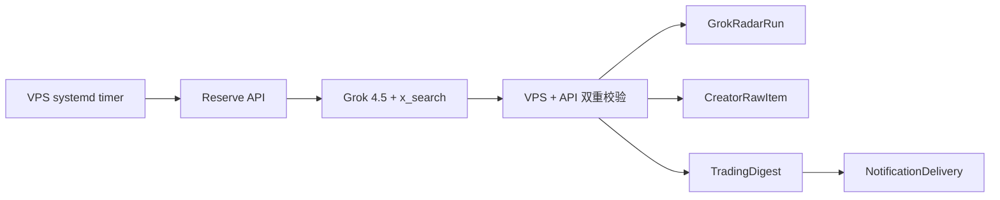

# 交易博主雷达：首页与数据设计

Status: proposed  
Last updated: 2026-07-22

本文定义 Grok 交易博主雷达下一版首页的信息架构、页面状态和数据读取契约。它建立在 `GROK-RADAR-TECHNICAL-DESIGN.md` 已确定的采集链路上，不改变当前 Grok CLI、VPS、Vercel 和 Supabase 的部署边界，也不在本阶段授权页面开发。

## 1. 产品定位

交易博主雷达是一个低频更新的个人交易情报页，不是实时 Timeline，也不是自动交易工具。

用户打开页面时最先需要回答四个问题：

1. 这一期有什么值得注意的结论？
2. 哪些博主形成了共识，哪些地方存在分歧？
3. 结论来自哪些原帖，证据是否明确？
4. 数据覆盖到什么时候，下一次什么时候更新？

因此下一版首页采用以下产品层级：

```text
简报是主体
观点是结构
原帖是证据
博主管理和策略是设置
```

当前三栏页面仍可作为数据验收和管理入口，但不应继续把空的推文时间线放在视觉中心，也不应让关注列表长期占据约三分之一页面。

## 2. 已确定的运行方式

- 最多四个启用博主。
- 当前启用 `@KillaXBT` 和 `@yijiangren`。
- 关键词固定为“美股”和“BTC”。
- 每轮只调用一次 `grok-4.5`，reasoning effort 为 `medium`。
- 一次调用合并查询全部启用博主，不按博主分别计费。
- 每个 xAI 周额度窗口最多调用约 21 次（应用层 `GROK_RADAR_MAX_RUNS_PER_WINDOW`，按约 2%/次估算）；失败调用也占额度。
- 默认 timer 为北京时间每天 08:30 / 14:30 / 20:30，并允许最多 5 分钟随机延迟。
- 原始运行结果、帖子、摘要和信号写入 Supabase；页面不读取 VPS 文件。
- 所有观点必须保留原推 URL，Grok 搜索摘录不能伪装为官方 Timeline payload。
- URL status ID 的 Snowflake 时间必须落在搜索窗口，并与 `publishedAt` 一致；raw 中必须能证明发生了真实 `x_search` 工具调用。

### 2.1 调度频率与模型额度是两件事

`systemd timer` 决定“什么时候尝试运行”，Supabase reservation 决定“这次是否允许调用模型”。

```text
timer 触发（每天 3 次）
  → 请求 reserve
  → 本周少于 21 次：允许调用 Grok
  → 本周已经 21 次：返回 429，不调用 Grok
```

页面状态栏的 `used/limit` 是应用自建 reservation 次数，不是 xAI 官方额度百分比。

## 3. 首页目标

首页默认展示最新一期成功的真实报告，让用户在十秒内理解本期市场观点，并能在两次点击内回到证据原文。

首页不承担以下任务：

- 实时行情、K 线和价格提醒；
- 仓位、订单、止盈止损或自动下单；
- 逐条复刻指定博主的完整 Timeline；
- 为缺失的入场价或失效条件补写交易计划；
- 在页面切换博主时再次调用模型。

## 4. 推荐信息架构

### 4.1 顶部：数据新鲜度

页面顶部只保留一条紧凑状态栏：

- 报告覆盖窗口；
- 本期分析博主数和有效帖子数；
- 最近一次真实成功时间；
- 下一次计划采集时间；
- 本周额度，例如 `3/21`；
- 最近失败状态，仅在失败时出现。

“Grok 模式不支持立即刷新”和禁用的“立即刷新”按钮不同时出现。Grok 模式首页直接移除立即刷新按钮，在设置页说明采集计划即可。

fixture 运行不能作为首页“最近成功”的默认来源。状态 API 应区分 `fixture` 与真实运行，首页默认只使用真实成功记录。

### 4.2 首屏：最新交易简报

首屏使用一张完整宽度的报告卡：

```text
最新交易简报                                      7 月 22 日
过去 7 天，两位博主对 BTC 的共同关注点是……

[BTC 条件看多] [美股观望] [2 位博主] [5 条证据]

主要结论
1. ……
2. ……
3. ……
```

字段：

- 报告标题；
- 搜索窗口；
- 最多三条 `digestSummary`；
- 覆盖博主数；
- 有效 finding 数；
- 模型和 reasoning effort；
- Prompt 版本和策略版本，用于追溯但默认弱化显示。

没有有效 finding 时仍生成“本期暂无明确交易观点”的空报告，不能显示成系统加载失败。

### 4.3 第二层：标的观点卡

按标的聚合信号，第一版优先显示 `BTC` 和“美股/股票代码”。每张卡包含：

- 标的；
- 方向：`LONG | SHORT | WATCH | NONE`；
- 原文明确的入场价格；
- 原文明确的入场时机；
- 原文明确的失效条件；
- 策略关系：符合、冲突、无法判断；
- 发表该观点的博主；
- 证据数量和原文入口。

任何没有 evidence 的交易字段必须显示“未明确”，不能因为卡片留白而推断内容。

同一标的出现相反方向时，不合并成一个方向，而是显示“存在分歧”，并列出双方证据。

### 4.4 第三层：博主观点对比

桌面端使用紧凑表格，移动端使用纵向卡片：

| 博主 | BTC | 美股 | 本期关键条件 | 有效证据 |
| --- | --- | --- | --- | --- |
| KillaXBT | 条件看多 | 暂无 | 月线条件确认 | 2 |
| yijiangren | 观望 | 科技股关注 | 等待事件确认 | 3 |

表格内容由本期 findings 聚合，不引入第二次模型调用。无法可靠归类时显示“未明确”。

### 4.5 第四层：原帖证据

原帖列表是简报的证据区，不再是首屏主体。默认只展示本期被摘要或信号引用的帖子：

- 博主 handle；
- 发布时间；
- 原文或 Grok 可验证摘录；
- `Grok AI 搜索采集` 标记；
- `搜索摘录` 标记；
- 被哪些摘要或信号引用；
- “查看原推”链接。

用户可以展开“本期其他发现”查看未被核心结论引用的有效帖子，也可以进入历史报告查看旧证据。

### 4.6 设置抽屉

以下低频操作移入右上角“设置”：

- 关注博主的添加、停用和恢复；
- 当前启用数量 `2/4`；
- 关键词；
- 模型和 reasoning effort，只读展示；
- 每周运行次数与下一次时间；
- 交易策略文本和版本；
- Telegram 配置状态。

第一版仍不允许从页面物理删除博主和历史证据。

## 5. 页面线框

```text
┌──────────────────────────────────────────────────────────────┐
│ 交易博主雷达                           历史报告  设置         │
│ 7/15—7/22 · 2 位博主 · 5 条证据 · 下次周五 08:30 · 2/2      │
├──────────────────────────────────────────────────────────────┤
│ 最新交易简报                                                 │
│ 一句话结论                                                   │
│ 1. 摘要                                                     │
│ 2. 摘要                                                     │
│ 3. 摘要                                                     │
├─────────────────────────────┬────────────────────────────────┤
│ BTC                         │ 美股                           │
│ 方向 / 条件 / 失效 / 策略   │ 方向 / 条件 / 失效 / 策略     │
│ 查看 2 条证据               │ 查看 3 条证据                  │
├──────────────────────────────────────────────────────────────┤
│ 博主观点对比                                                 │
│ KillaXBT ...                                                 │
│ yijiangren ...                                               │
├──────────────────────────────────────────────────────────────┤
│ 原帖证据                                                     │
│ @handle · 时间 · 摘录 · Grok 搜索采集 · 查看原推            │
└──────────────────────────────────────────────────────────────┘
```

## 6. 数据写入链路



### 6.1 当前上线阻断：X Snowflake 时间校验

2026-07-22 的首次真实计划链路运行 `20260722T101125Z-8fa6130b25` 在技术上成功写入六条 finding 和一条 Digest，但数据真实性校验失败，不能作为交易信息展示：

- 六个 X status ID 解码出的创建时间均为 2026-03-13；
- Grok 返回的 `publishedAt` 均为 2026-07-22；
- 部分 status ID 带明显的占位数字模式；
- 当前校验器只验证 Grok 声明的 `publishedAt` 是否位于 reservation 窗口，没有验证 status ID 自带时间。

X status ID 是 Snowflake ID，可以确定性解码创建时间：

```text
createdAtMs = (BigInt(statusId) >> 22) + 1288834974657
```

摄取前必须新增以下硬门槛：

1. 从 URL 提取纯数字 status ID；
2. 解码 Snowflake 创建时间；
3. Snowflake 时间必须位于 reservation 搜索窗口；
4. Snowflake 时间与 Grok `publishedAt` 的差异不得超过允许误差；
5. 不满足时以 `status_timestamp_mismatch` 拒绝整条 finding；
6. 只有通过确定性校验的 finding 才能进入 `CreatorRawItem` 和 Digest；
7. 如果本轮全部 finding 被拒绝，保存一份正常的空报告或失败状态，不展示模型生成的正文与交易信号。

原推可访问性可作为附加核验，但不能替代 Snowflake 校验。X 页面可能因登录、限流或地区原因暂时不可访问，而 Snowflake 时间校验是无需额外 API、不会消耗模型额度的确定性门槛。

在该门槛实现并完成 replay 验收前，生产 `grok-radar.timer` 应保持关闭。上述运行数据保留用于问题复现，但首页不得把它计为可信报告。

### 6.2 `GrokRadarRun`

一条记录代表一次模型额度预占和运行，是状态栏与历史报告的运行事实源。

首页需要：

- `id`；
- `status`；
- `windowStart`、`windowEnd`；
- `model`、`reasoningEffort`；
- `creatorHandles`、`keywords`；
- `strategyVersion`；
- `usage`；
- `reservedAt`、`completedAt`；
- `error`；
- 是否 fixture。

当前 fixture 标记位于 `rawPayload.raw.fixture`。后续建议提升为显式字段 `runKind = REAL | FIXTURE | REPLAY`，避免列表和最近成功状态依赖 JSON 路径判断。

### 6.3 `CreatorRawItem`

一条记录代表一个经过校验的帖子发现，是所有结论的证据源。

首页需要：

- `creatorId` 与 `creator.handle`；
- `externalId`；
- `sourceUrl`；
- `body`；
- `publishedAt`；
- `postType`；
- `grokRunId`；
- `payload.captureMethod`；
- `payload.sourceTextKind`；
- `payload.requiresSourceVerification`。

数据库以 `(creatorId, externalId)` 唯一约束去重，同一个帖子在重叠搜索窗口中再次出现时不重复展示。

### 6.4 `TradingDigest`

一条记录代表一期可展示报告，是首页主体的数据源。

首页需要：

- `sourceGrokRunId`；
- `creatorIds`；
- `rawItemIds`；
- `summary`；
- `signals`；
- `promptVersion`；
- `strategyVersion`、`strategySnapshot`；
- `createdAt`。

首页应以 `sourceGrokRunId` 关联运行窗口和模型信息，以 `rawItemIds` 关联证据帖子。不能仅按“当前选中的博主组合”寻找最新摘要，否则用户多选或取消博主后可能看不到已经存在的本期报告。

### 6.5 `NotificationDelivery`

只为首页提供 Telegram 投递状态，不参与简报内容：

- `NOT_CONFIGURED`：显示未配置；
- `PENDING`：等待发送；
- `SENT`：已发送；
- `FAILED`：可查看错误。

投递失败不能隐藏已经成功保存的报告。

## 7. 推荐的首页读取契约

当前 `GET /api/trading-radar` 同时返回管理列表、当前筛选帖子和摘要，适合现有三栏 UI。总结优先首页建议增加独立只读接口：

```http
GET /api/trading-radar/reports/latest
```

建议响应：

```json
{
  "report": {
    "id": "digest-id",
    "runId": "run-id",
    "window": {
      "since": "2026-07-15T08:30:00Z",
      "until": "2026-07-22T08:30:00Z"
    },
    "generatedAt": "2026-07-22T08:32:00Z",
    "model": "grok-4.5",
    "reasoningEffort": "medium",
    "creators": [
      { "id": "creator-id", "handle": "killaxbt", "displayName": "KillaXBT" }
    ],
    "summary": ["……"],
    "signals": [
      {
        "asset": "BTC",
        "direction": "LONG",
        "entryPrice": "未明确",
        "entryTiming": "……",
        "invalidation": "未明确",
        "strategyMatch": "UNKNOWN",
        "strategyReason": "……",
        "evidencePostIds": ["post-id"]
      }
    ],
    "posts": [
      {
        "id": "post-id",
        "creatorHandle": "killaxbt",
        "publishedAt": "2026-07-21T15:17:26Z",
        "body": "……",
        "sourceUrl": "https://x.com/.../status/...",
        "captureMethod": "grok_cli_x_search",
        "requiresSourceVerification": true
      }
    ],
    "delivery": { "telegram": "NOT_CONFIGURED" }
  },
  "schedule": {
    "nextRunAt": "2026-07-24T00:30:00Z",
    "quotaUsed": 2,
    "quotaLimit": 2,
    "quotaResetsAt": "2026-07-29T03:25:00Z"
  }
}
```

接口必须由服务端一次完成关系组装，客户端不应分别请求 run、digest、posts 后再推断证据关系。

## 8. 页面状态

### 8.1 尚无任何真实报告

显示：

- 已关注博主；
- 下次采集时间；
- “首期报告将在计划采集完成后生成”；
- 设置入口。

不显示大面积空 Timeline，也不把 fixture 当作真实成功。

### 8.2 本期无有效观点

显示一期正常报告：

- 搜索窗口和博主范围；
- “本期没有找到满足证据要求的明确交易观点”；
- rejected 数量及概括原因；
- 不生成占位信号。

### 8.3 运行失败

继续展示上一期成功报告，并在顶部显示：

- 本次失败时间；
- 失败阶段：预检、模型、校验或上传；
- 下一次计划时间；
- 不自动再次调用模型。

### 8.4 上传待处理

显示上一期报告和“新报告等待上传”，VPS只重放同一 raw，不再次调用模型。

### 8.5 报告已生成但 Telegram 失败

页面正常展示报告，只在投递状态中显示失败，允许后续独立重试。

## 9. 历史报告

首页只展示最新一期真实报告，另设历史入口：

- 按运行时间倒序；
- 展示窗口、博主、关键词、有效帖子数和状态；
- 可以打开当期摘要、信号、策略快照和证据；
- fixture 默认隐藏，可在运维视图查看；
- replay 不创建新的模型额度记录，也不伪装为新报告。

历史报告以 `GrokRadarRun → TradingDigest → CreatorRawItem` 为稳定关系，不依赖当前博主是否启用。

## 10. 实现顺序

本文确认后建议按以下顺序开发：

1. 增加 X Snowflake 时间一致性校验，并用当前失败 raw 做 replay 测试。
2. 隔离不可信运行，确保它不进入首页和 Telegram。
3. 在运行数据中显式区分真实、fixture 和 replay。
4. 新增 latest report 服务层，一次组装 run、digest、posts、creators 和 delivery。
5. 增加 `GET /reports/latest` 的稳定响应测试。
6. 实现总结优先首页和空/失败状态。
7. 将博主管理、策略和调度信息移动到设置抽屉。
8. 增加历史报告页。
9. 完成真实数据验收后恢复 timer。
10. 最后再考虑调整 timer 频率或增加模型额度。

## 11. 验收标准

- 打开首页时，最新真实简报在首屏完整可读。
- fixture 不影响“最近成功”和最新报告。
- 摘要最多三条，信号最多三组，不为缺失字段生成内容。
- 每条信号可以定位到本期证据帖子和原推 URL。
- 多位博主的共识和分歧可区分，不把相反方向合并。
- 空 findings 是正常报告状态，不显示成加载错误。
- 最新运行失败时仍保留上一期成功报告。
- Telegram 失败不影响页面报告。
- 页面切换和查看证据不触发新模型调用。
- 调度状态明确区分“下一次尝试时间”和“本周剩余额度”。
- status ID 解码时间与 `publishedAt`、搜索窗口一致；不一致的数据无法进入报告。
