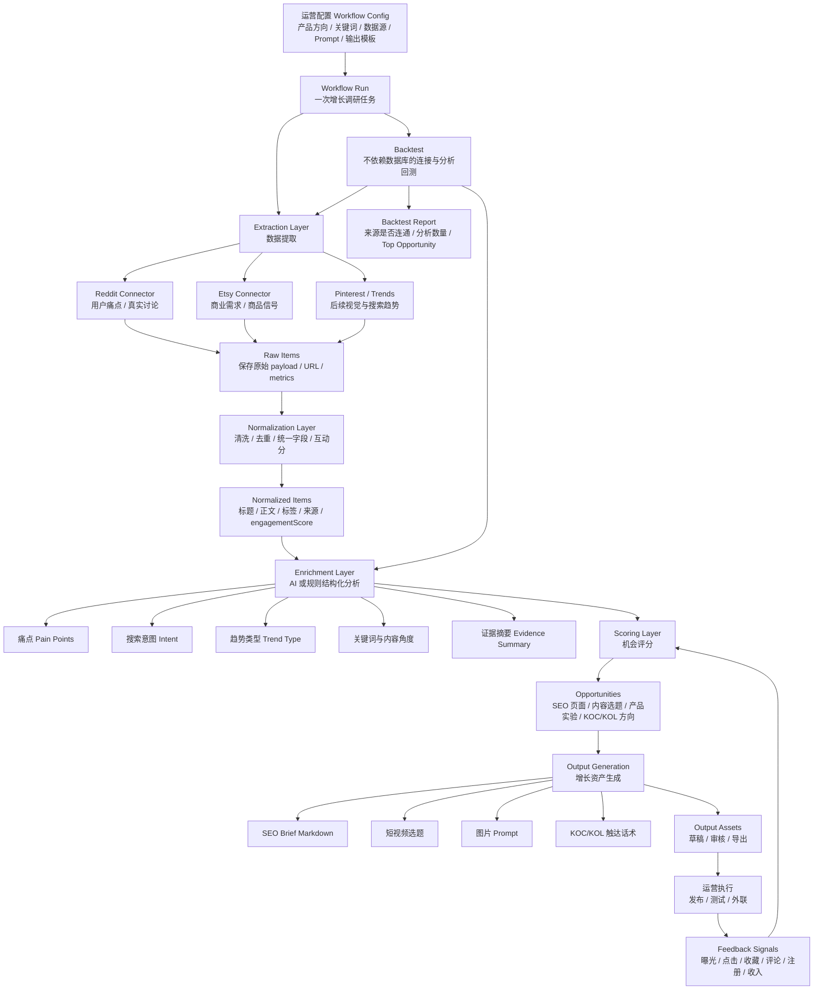

# Growth Automation Harness 产品链路图

当前产品围绕 `AI tattoo generator` 垂类，目标是把多源增长信号转成可执行的增长资产，并在后续通过反馈数据优化机会评分。

## 一句话链路

配置增长目标 -> 抓取多源信号 -> 保存原始数据 -> 清洗归一化 -> AI 分析 -> 机会评分 -> 生成增长资产 -> 运营执行 -> 反馈回流优化评分。

## 当前 MVP 已覆盖

- Workflow Config seed：固定 `AI tattoo generator` 产品方向和关键词。
- Connector：Reddit 真实搜索、Etsy API 接入点、mock fallback。
- Raw Item：保存来源、原始 payload、URL 和指标。
- Normalized Item：统一标题、正文、标签、来源和互动分。
- Enrichment：OpenAI-compatible AI 分析，缺少 API key 时回退到规则分析。
- Opportunity：基于证据和互动分生成机会评分。
- Output Asset：生成 Markdown SEO brief。
- Backtest：不依赖数据库，验证 Connector 和分析链路是否可用。

## 后续扩展方向

- 接入 Pinterest 或 Google Trends 做视觉/搜索趋势验证。
- 新增 DeepSearch Plan，把搜索问题、来源计划和证据包显式记录下来。
- 支持 Output Asset 审核、编辑、导出 Markdown/CSV。
- 记录执行后的 Feedback Signals，把真实效果回流到 Opportunity Score。
